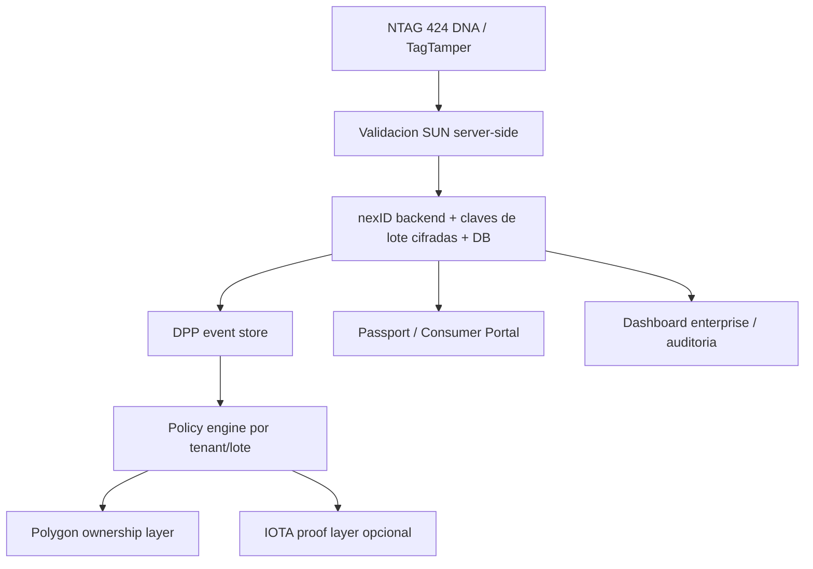

# Arquitectura blockchain enterprise nexID

Este documento define la arquitectura Enterprise Trust Layer de nexID cuando se combinan NFC criptografico, Digital Product Passport, Polygon e IOTA. Esta pensado para clientes enterprise, equipos tecnicos, operaciones y compliance.

## Resumen ejecutivo

nexID no usa blockchain como base de datos principal ni como destino de todos los taps. La fuente de verdad operativa es el backend de nexID: valida el chip, aplica politicas del tenant, registra eventos DPP y expone auditoria interna.

Blockchain se usa en dos capas separadas y gobernadas por policy:

- **Polygon ownership layer**: propiedad digital, NFT/certificado, claim del producto, warranty transfer y transferencias controladas.
- **IOTA proof layer opcional**: pruebas de auditoria, evidencia logistica, checkpoints DPP, hashes y Merkle roots verificables de eventos seleccionados.

IOTA puede estar completamente deshabilitado sin romper autenticacion NFC, passport, claim ni tokenizacion Polygon. Polygon e IOTA no cumplen el mismo rol y no deben mezclarse en el discurso comercial.

## Principios no negociables

1. **Polygon conserva ownership/NFT/claim**. Si un producto se reclama, tokeniza o transfiere como certificado digital, la capa de propiedad es Polygon.
2. **IOTA es opcional y probatorio**. IOTA puede aportar evidencia adicional para auditoria, DPP o logistica, pero no reemplaza el NFT ni el claim.
3. **No se publica PII on-chain**. Emails, telefonos, nombres, direcciones, documentos, geolocalizacion precisa y datos personales quedan off-chain.
4. **No se publica data cruda de negocio on-chain**. Precios, condiciones comerciales, inventario sensible, rutas completas, facturas, contratos y manifest completos quedan en sistemas privados.
5. **No se publica UID crudo ni secretos SUN**. La cadena nunca recibe UID real, claves de encoding, master keys, payload SUN completo, CMAC completo como secreto operativo ni private keys.
6. **No todos los taps van on-chain**. Los taps se registran en el backend. Solo eventos seleccionados por politica se anclan o tokenizan.
7. **Sin claims falsos de alianzas o costo cero**. La documentacion no debe afirmar alianzas formales con Polygon/IOTA ni gratuidad operativa. Costos, limites y disponibilidad dependen de red, RPC, proveedor y volumen.
8. **Hashes y Merkle roots antes que datos crudos**. Cuando se necesita prueba publica, publicar digests o Merkle roots minimizados. El evento completo queda off-chain con acceso controlado.

## Capas de confianza

### 1. Evidencia criptografica del tag NFC

El chip NFC genera una URL SUN/SDM dinamica. El backend valida criptograficamente:

- CMAC y payload SDM.
- UID decodificado contra manifest.
- Contador y replay.
- Estado TagTamper si el lote lo soporta.
- Estado de batch, tenant y allowlist.

Esta capa prueba que el backend recibio un mensaje fresco atribuible a un tag provisionado bajo las claves y reglas configuradas. No certifica por si sola el contenido, origen, condicion ni custodia fisica del producto. Blockchain no reemplaza esta validacion ni agrega esa prueba fisica ausente.

### 2. Registro DPP privado

Cada tap o evento operativo se registra en el backend como evento DPP interno. Este registro puede incluir datos necesarios para soporte, fraude, analytics y compliance, pero se protege segun clasificacion de datos.

Ejemplos de datos internos:

- `tenant_id`, `batch_id`, `event_id`.
- UID interno o hash interno.
- Verdict SUN.
- Estado de replay/tamper.
- Canal, pais o region aproximada si aplica.
- Datos tecnicos minimos para debugging.

### 3. Polygon ownership layer

Polygon se usa cuando la plataforma necesita un registro publico de propiedad digital o certificado:

- Claim de producto por un consumidor o tenant.
- NFT/certificado digital asociado al registro y a la politica del tenant.
- Transferencia de garantia o titularidad digital cuando el tenant lo habilita.
- Token URI con metadata publica sanitizada.

Polygon no debe recibir cada tap, cada ubicacion ni cada interaccion del consumidor.

### 4. IOTA proof layer opcional

IOTA se usa solo si el tenant o la vertical necesita evidencia adicional:

- Hash de un evento DPP seleccionado.
- Checkpoint periodico de varios eventos.
- Merkle root de eventos de una ventana temporal o lote.
- Prueba de recepcion de manifest.
- Evidencia de handoff logistico.
- Digest de certificado de calidad o inspeccion.

Si `IOTA_PROOF_ENABLED=false`, el sistema debe seguir operando con DPP privado y propiedad digital en Polygon cuando este habilitada.

## Politica de anclaje

La regla por defecto es **off-chain first, on-chain when useful**.

| Evento | Registro backend | Polygon | IOTA opcional |
| --- | --- | --- | --- |
| Tap valido comun | Si | No por defecto | No por defecto |
| Replay o tap riesgoso | Si | No | Solo checkpoint agregado o Merkle root si compliance lo pide |
| Claim de producto | Si | Si | Puede anclar digest del claim |
| Mint de certificado | Si | Si | Puede anclar proof envelope |
| Alta de lote | Si | No | Puede anclar hash de manifest sanitizado |
| Handoff logistico | Si | No | Puede anclar digest del handoff |
| Auditoria mensual | Si | No | Puede anclar Merkle root/checkpoint |

## Supplier Encoding Pack y Tenant Vault

Las operaciones de fabrica pertenecen a la fuente de verdad privada de nexID. Un Supplier Encoding Pack entrega a la fabrica solo lo necesario para codificar cada sub-batch: `order_id`, `batch_id`, `sub_batch_id`/`bid`, chip model, perfil SDM/TagTamper, route template redacted para documentacion publica, formato de manifest y claves de encoding del sub-batch por canal cifrado.

La fabrica nunca recibe master keys, database URLs, private keys de Polygon, secretos de executor, tokens admin ni PII. Tenant Vault muestra evidencia operativa para el tenant: estado de orden, sub-batches, fingerprints, manifest, hashes, Merkle roots sanitizados, reportes QA y eventos DPP autorizados. No es una UI para revelar secretos.

Polygon no se usa para manifest de proveedor ni QA de fabrica. Polygon se usa si hay ownership, NFT/certificado, claim o transferencia. IOTA puede usarse como proof opcional para hash/Merkle root de manifest, QA, DPP o logistica.

## Clasificacion de datos

| Categoria | Ubicacion permitida | Observacion |
| --- | --- | --- |
| PII de consumidor | Backend privado / proveedor autorizado | Nunca on-chain |
| UID crudo | Backend seguro si es necesario | Nunca on-chain; preferir hash interno |
| Claves SUN de lote | Backend, cifradas bajo secreto de aplicación Vercel | Nunca frontend, nunca blockchain; este flujo no es KMS/HSM administrado |
| Wallets IOTA/Polygon testnet | Executor aislado + envelope Google Cloud KMS SOFTWARE | No es HSM ni firma asimétrica no exportable; plaintext existe brevemente en memoria del executor |
| Manifest completo | Backend privado | IOTA solo puede recibir hash/checkpoint |
| Evento DPP completo | Backend privado | On-chain solo digest sanitizado |
| Certificado publico | Polygon metadata sanitizada | Sin PII ni datos comerciales sensibles |
| Evidencia logistica | Backend privado + digest IOTA opcional | No publicar rutas completas sensibles |

## Degradacion y disponibilidad

La arquitectura debe degradar por capas:

- Si IOTA esta deshabilitado o no disponible, siguen funcionando SUN, passport, dashboard y Polygon.
- Si Polygon esta no disponible, se puede crear una solicitud pendiente de claim/tokenizacion y completar luego.
- Si el RPC falla, no se debe simular una transaccion real como si hubiera ocurrido.
- Si el backend SUN no puede validar, no hay claim ni prueba confiable aunque la blockchain este disponible.

## Lenguaje aprobado para clientes

Usar:

- "nexID registra propiedad digital en Polygon cuando hay un claim o certificado aplicable."
- "nexID puede anclar hashes y Merkle roots verificables en IOTA para auditoria y evidencia logistica."
- "Los datos sensibles permanecen off-chain."
- "No todos los taps se escriben en blockchain; se registran en nexID y solo algunos eventos se anclan segun politica."
- "Enterprise Trust Layer separa evidencia criptografica NFC, DPP privado, ownership Polygon y proof IOTA opcional."

Evitar:

- "Anclaje publico de cada tap."
- "Costo operativo cero de red, RPC o custodia."
- "Alianza formal" o "partner oficial" con IOTA/Polygon salvo que exista contrato publico verificable.
- "El NFT reemplaza automaticamente la propiedad legal del producto."
- "La cadena contiene la informacion completa del cliente o del envio."
